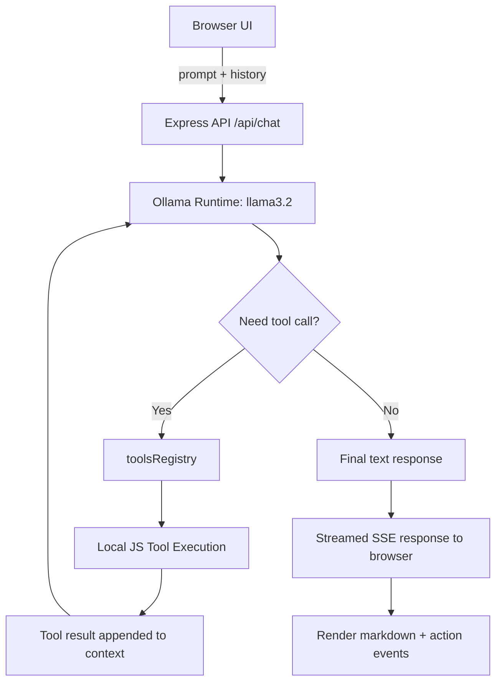
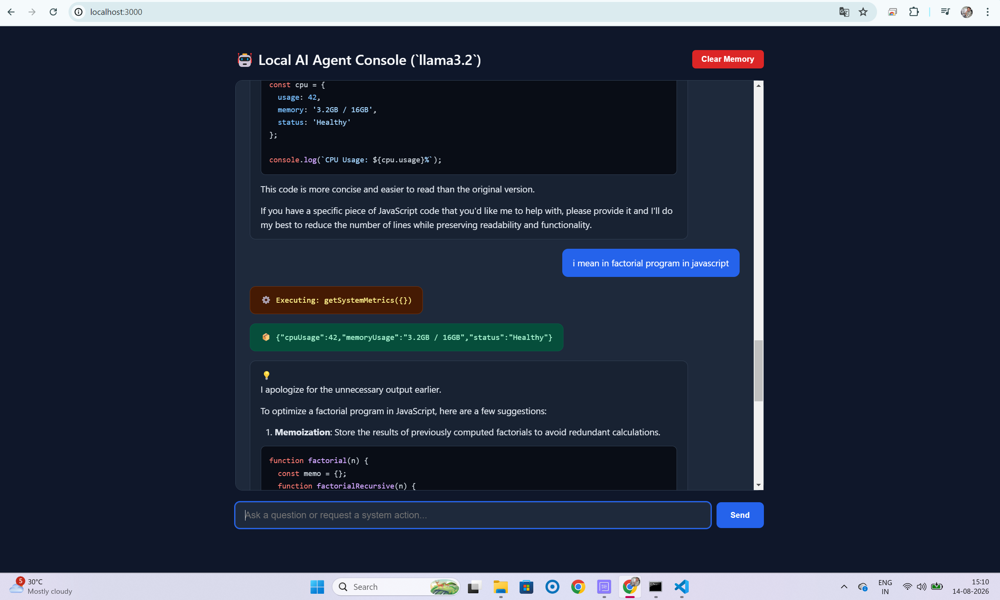

# 🤖 NodeAgent


A lightweight local AI agent web app built with Node.js and Express, powered by Ollama and the `llama3.2` model. It exposes a browser-based chat interface that can answer questions and execute local tools when needed.

## ⚡ How it works in one minute

1. The browser sends your prompt to the Express API.
2. The Node.js server forwards the chat history to the local Ollama model.
3. The model decides whether it needs a tool or can answer directly.
4. If a tool is needed, the server executes a registered local function.
5. The tool result is added back to the conversation and the model continues reasoning.
6. The final response is streamed back to the browser in real time.

This creates a simple local agent loop: prompt → model reasoning → tool execution → final answer.

## 🧠 Overview

This project demonstrates a simple AI agent pattern using:

- Express server with a streaming chat API
- Ollama chat integration for local LLM inference
- Tool calling with a small function registry
- Server-sent events (SSE) for live UI updates
- Markdown rendering in the browser for assistant responses

The app can answer general prompts and also perform local actions such as checking system metrics or restarting a named service.

## ✨ Features

- Chat with a local Ollama model
- Streaming responses in real time
- Tool calling support for local operations
- Browser-based conversational UI
- Markdown-formatted assistant messages
- Local conversation memory in the browser

## 🧰 Tech Stack

- Node.js
- Express
- Ollama
- JavaScript / ES modules

## ✅ Prerequisites

Before running the project, make sure you have:

1. Node.js installed
2. Ollama installed and running locally
3. The `llama3.2` model pulled in Ollama

To verify Ollama is available:

```bash
ollama --version
```

To pull the required model:

```bash
ollama pull llama3.2
```

## 📦 Installation

Clone the repository and install dependencies:

```bash
git clone <your-repository-url>
cd NodeAgent
npm install
```

## ▶️ Running the App

Start the server from the project root:

```bash
node server.js
```

Then open the app in your browser:

```text
http://localhost:3000
```

## 🗂️ Project Structure

```text
NodeAgent/
├── server.js
├── public/
│   └── index.html
├── package.json
├── package-lock.json
└── README.md
```

## 🏗️ Architecture Overview

This project follows a lightweight agent architecture designed for local experimentation and tool-augmented reasoning. The system is intentionally simple: the browser handles the UI and conversation state, while the backend remains stateless and delegates reasoning to Ollama.

### High-Level Flow

1. The browser keeps the current conversation in `localStorage`.
2. When the user submits a prompt, the browser sends a POST request to `/api/chat`.
3. The Express server receives the request and builds the message history for the LLM.
4. The server calls the local Ollama runtime with the configured model (`llama3.2`).
5. The model decides whether to:
   - answer directly, or
   - request a tool call such as `getSystemMetrics` or `restartService`.
6. If a tool is needed, the server executes the matching function from the local registry.
7. The tool result is appended back into the chat context and sent back to the model for the next reasoning pass.
8. The final answer is streamed to the client using Server-Sent Events (SSE), and the browser renders the updates in real time.

### Detailed Request Lifecycle



```text
Browser UI ──> Express API ──> Ollama model
                           │
                           ├── no tool needed ──> final answer
                           │
                           └── tool needed ──> local JS tool ──> result back to model
```

### Why this design works

- Stateless backend: the server does not keep agent state between requests.
- Local-first execution: model inference runs on the local machine via Ollama.
- Tool-augmented reasoning: the model can decide when a real-world action is required.
- Streaming UX: the browser progressively renders tool execution steps and final output.
- Simple extensibility: new tools can be added by registering them in the `toolsRegistry` and exposing their schema to Ollama.

This pattern is a minimal but practical example of an agent loop: prompt → model reasoning → tool execution → context update → final response.

## 💬 Example Usage

In the browser, try prompts like:

- "What is the current CPU and memory usage?"
- "Restart the redis service"
- "Explain how this app works"

The server will stream tool execution updates and tool output while the model decides whether a local function call is needed.

## 🛠️ Adding Custom Tools

This project is designed to be extended with additional local tools. A custom tool generally follows a simple pattern:

1. Add a function to the `toolsRegistry`
2. Register the function schema in the `tools` array
3. Make sure the tool returns JSON-serializable data
4. Write a clear description so the model knows when to use it

### Example: add a file listing tool

```js
const toolsRegistry = {
  getSystemMetrics: async () => {
    return { cpuUsage: 42, memoryUsage: "3.2GB / 16GB", status: "Healthy" };
  },

  restartService: async (args) => {
    const serviceName = typeof args === "string" ? args : args?.serviceName;
    return { service: serviceName, status: "restarted", timestamp: new Date().toISOString() };
  },

  listDirectory: async (args) => {
    const dir = typeof args === "string" ? args : args?.dir || ".";
    const fs = await import("fs/promises");
    const files = await fs.readdir(dir);
    return { directory: dir, files };
  }
};
```

Then register its schema so Ollama can call it:

```js
const tools = [
  {
    type: "function",
    function: {
      name: "listDirectory",
      description: "List files in a given directory.",
      parameters: {
        type: "object",
        properties: {
          dir: {
            type: "string",
            description: "Directory path to inspect, for example '.' or './public'."
          }
        },
        required: ["dir"]
      }
    }
  }
];
```

### Best practices for custom tools

- Keep each tool focused on a single responsibility
- Accept simple, well-defined arguments
- Return structured JSON data
- Validate input before performing any action
- Avoid risky operations unless they are intentional and clearly documented
- Write descriptions that clearly explain when the tool should be used

This allows the model to decide when a tool is appropriate and helps keep the agent behavior predictable and safe.

## ⚠️ Important Note

The app is built for local development and experimentation. The current tool registry includes examples like:

- `getSystemMetrics`
- `restartService`

These functions are intentionally lightweight and meant to demonstrate how tool calling works with Ollama and a web interface.

## � Troubleshooting

If the app does not start or respond as expected, these are the most common issues to check.

### 1. Ollama is not running

Make sure Ollama is installed and the service is active before starting the app.

```bash
ollama --version
```

If the command fails, install Ollama and start it before running this project.

### 2. Model not found

This app expects the `llama3.2` model to be available locally.

```bash
ollama pull llama3.2
```

If the model is missing, the server may fail when it tries to call Ollama.

### 3. Port already in use

The app listens on port `3000`. If another process is already bound to that port, the server will not start correctly.

On Windows, check which process is using the port:

```powershell
netstat -ano | findstr :3000
```

Then stop the process if needed.

### 4. App fails with `Cannot find module` or startup errors

Verify that you are running the server from the project root:

```bash
node server.js
```

If you previously ran the wrong path, such as `node public/server.js` when the file is not in that location, the app will fail to start.

### 5. Browser cannot connect

Make sure the server is running and then open:

```text
http://localhost:3000
```

If the page does not load, confirm the server log shows:

```text
🚀 Agent Web UI ready at http://localhost:3000
```

### 6. Tool calls fail

Custom tools are intentionally lightweight, and the model may trigger them only when appropriate. If a tool call fails, verify:

- the function name matches the registered schema
- the arguments are valid JSON
- the tool returns JSON-serializable data
- the tool is included in the `toolsRegistry`

### 7. Node dependencies are not installed

Install project dependencies before running the app:

```bash
npm install
```

## �📄 License

This project is licensed under the ISC License.

## 🚀 Notes for GitHub Upload

Before pushing to GitHub:

1. Create a new repository on GitHub
2. Run the git commands to push the project
3. Optionally add a `.gitignore` to exclude `node_modules` and other local files

Example:

```bash
git init
git add .
git commit -m "Initial commit"
git branch -M main
git remote add origin <your-github-repository-url>
git push -u origin main
```

## 🤝 Contributing

Pull requests are welcome. If you improve tool handling, add more local tools, or enhance the browser UI, feel free to contribute.

## 📸 Screenshot


