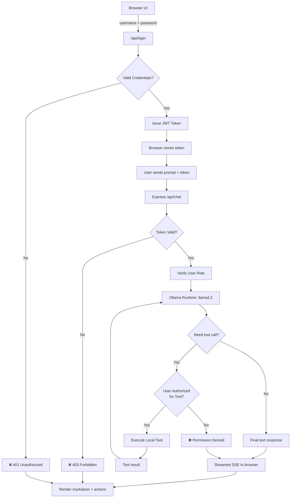
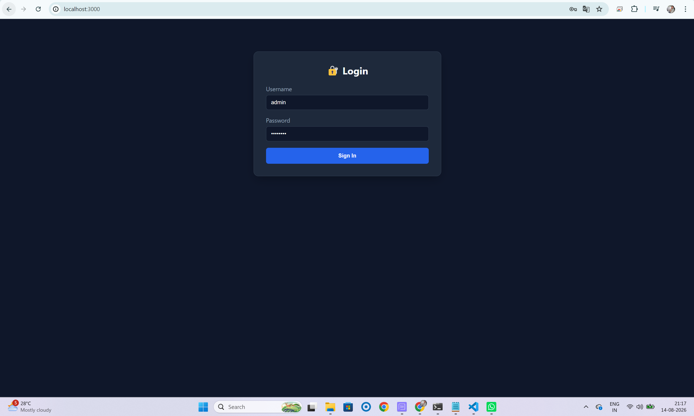
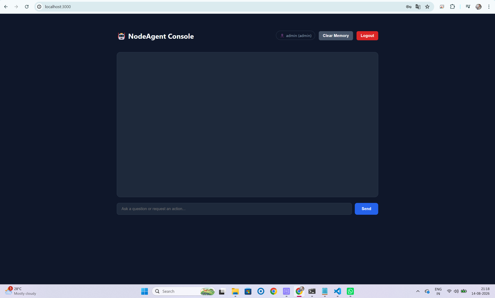

# 🤖 AI Agent Node.js


A lightweight local AI agent web app built with Node.js and Express, powered by Ollama and the `llama3.2` model. It exposes a browser-based chat interface that can answer questions and execute local tools when needed.

## ⚡ How it works in one minute

1. The browser sends your prompt to the Express API.
2. The Node.js server forwards the chat history to the local Ollama model.
3. The model decides whether it needs a tool or can answer directly.
4. If a tool is needed, the server executes a registered local function.
5. The tool result is added back to the conversation and the model continues reasoning.
6. The final response is streamed back to the browser in real time.

This creates a simple local agent loop: prompt → model reasoning → tool execution → final answer.

## 🧠 Overview

This project demonstrates a simple AI agent pattern using:

- Express server with a streaming chat API
- Ollama chat integration for local LLM inference
- Tool calling with a small function registry
- Server-sent events (SSE) for live UI updates
- Markdown rendering in the browser for assistant responses

The app can answer general prompts and also perform local actions such as checking system metrics or restarting a named service.

## ✨ Features

- Chat with a local Ollama model
- Streaming responses in real time
- Tool calling support for local operations
- Browser-based conversational UI
- Markdown-formatted assistant messages
- Local conversation memory in the browser
- **JWT-based authentication** with secure password handling
- **Role-based authorization** for tool access control
- User sessions with configurable token expiration

## 🧰 Tech Stack

- Node.js
- Express
- Ollama
- JavaScript / ES modules
- JWT (JSON Web Tokens) for authentication
- bcryptjs for password hashing

## 🔐 Authentication & Authorization

This app implements a **JWT-based authentication system** with **role-based access control (RBAC)** for tools. Every user must log in to access the chat API.

### User Roles

The app supports two user roles with different permission levels:

| Role | Permission Level | Can Call | Restrictions |
|------|------------------|----------|---|
| **admin** | Full access | All tools including `restartService` | Unrestricted |
| **user** | Limited access | Read-only tools like `getSystemMetrics` | Cannot execute service operations |

### Default Test Users

The following users are pre-configured for testing:

| Username | Password | Role |
|----------|----------|------|
| `admin` | `admin123` | admin |
| `viewer` | `user123` | user |

⚠️ **Important:** Change these credentials in production by updating the `USERS` array in [auth.js](auth.js) and implement a proper database.

### Login Flow

1. Client sends `POST /api/login` with username and password
2. Server validates credentials against bcrypt-hashed passwords
3. On success, server issues a JWT token valid for **8 hours**
4. Client stores token and sends it in the `Authorization: Bearer <token>` header for all subsequent API calls
5. Server middleware (`authenticateToken`) validates the token before processing requests

### Example Login Request

```bash
curl -X POST http://localhost:3000/api/login \
  -H "Content-Type: application/json" \
  -d '{"username":"admin","password":"admin123"}'
```

**Response:**
```json
{
  "token": "eyJhbGciOiJIUzI1NiIsInR5cCI6IkpXVCJ9...",
  "role": "admin",
  "username": "admin"
}
```

### Tool Authorization

Tools can enforce role-based checks. For example, the `restartService` tool is restricted to **admin** users:

```javascript
restartService: async (args, user) => {
  // Role-based authorization check
  if (user.role !== 'admin') {
    return {
      error: `Permission Denied: User '${user.username}' (${user.role}) cannot restart services.`,
    };
  }
  // ... perform service restart
}
```

When a non-admin user attempts to restart a service, they receive a permission denied error instead of the operation being performed.

### Adding Custom Authorization Rules

When adding new tools, include role checks as needed:

```javascript
const toolsRegistry = {
  restrictedTool: async (args, user) => {
    if (!['admin', 'poweruser'].includes(user.role)) {
      return { error: 'Insufficient permissions' };
    }
    // Tool logic here
  }
};
```

## ✅ Prerequisites

Before running the project, make sure you have:

1. Node.js installed
2. Ollama installed and running locally
3. The `llama3.2` model pulled in Ollama
4. Required npm packages: `jsonwebtoken` and `bcryptjs` (installed via `npm install`)

To verify Ollama is available:

```bash
ollama --version
```

To pull the required model:

```bash
ollama pull llama3.2
```

## � Security & Production Deployment

The current implementation is designed for **local development and testing**. To deploy this app in production, implement these security measures:

### Authentication Security

- **Change default credentials** immediately
  - Update `USERS` array in [auth.js](auth.js) with real user accounts
  - Set strong, unique passwords for each user

- **Update JWT Secret**
  ```javascript
  export const JWT_SECRET = 'change-this-to-a-strong-random-secret-in-production';
  ```
  Generate a strong secret using: `node -e "console.log(require('crypto').randomBytes(32).toString('hex'))"`

- **Use HTTPS/TLS** in production to encrypt tokens in transit

### Authorization Best Practices

- **Implement principle of least privilege** – grant users only the permissions they need
- **Add custom roles** as your tool set expands (e.g., 'developer', 'poweruser', 'viewer')
- **Audit tool calls** – log which users executed which tools and when
- **Review tool descriptions** – ensure model has clear guidance on role requirements

### Database Integration

Replace the in-memory `USERS` array with a proper database:

```javascript
// Example: PostgreSQL with user lookup
export async function getUserFromDatabase(username) {
  const result = await db.query('SELECT * FROM users WHERE username = $1', [username]);
  return result.rows[0];
}
```

### Rate Limiting & DoS Protection

- Add rate limiting to `/api/login` to prevent brute force attacks
- Implement exponential backoff or account lockout after failed attempts
- Use middleware like `express-rate-limit`

### Monitoring & Logging

- Log all authentication attempts (successful and failed)
- Log all tool executions with user, tool name, timestamp, and result
- Monitor for unusual patterns (e.g., repeated failed logins, unauthorized tool calls)

### Session Management

- Set shorter token expiration times for sensitive environments
- Implement token refresh mechanisms
- Add token revocation support for logout

## �📦 Installation

Clone the repository and install dependencies:

```bash
git clone https://github.com/TechSivaram/node-ai-agent
cd node-ai-agent
npm install
```

## ▶️ Running the App

Start the server from the project root:

```bash
node server.js
```

Then open the app in your browser:

```text
http://localhost:3000
```

## 🗂️ Project Structure

```text
node-ai-agent/
├── server.js
├── auth.js
├── tools/
│   └── registry.js
├── public/
│   └── index.html
├── package.json
└── README.md
```

## 🏗️ Architecture Overview

This project follows a lightweight agent architecture designed for local experimentation and tool-augmented reasoning. The system is intentionally simple: the browser handles the UI and conversation state, while the backend remains stateless and delegates reasoning to Ollama.

### High-Level Flow

1. The browser keeps the current conversation in `localStorage`.
2. **User logs in** via `/api/login` and receives a JWT token.
3. When the user submits a prompt, the browser sends a POST request to `/api/chat` with the JWT token in the `Authorization` header.
4. The `authenticateToken` middleware validates the token and extracts user identity and role.
5. The Express server receives the request and builds the message history for the LLM.
6. The server calls the local Ollama runtime with the configured model (`llama3.2`), passing the user's identity in the system prompt.
7. The model decides whether to:
   - answer directly, or
   - request a tool call such as `getSystemMetrics` or `restartService`.
8. If a tool is needed, the server checks the tool's **authorization rules** using the user's role.
9. The tool is executed (if authorized) or returns a permission denied error.
10. The tool result is appended back into the chat context and sent back to the model for the next reasoning pass.
11. The final answer is streamed to the client using Server-Sent Events (SSE), and the browser renders the updates in real time.

### Detailed Request Lifecycle



```text
1. Login Flow:
   Browser ──> Login API ──> Validate Credentials ──> Issue JWT Token

2. Chat Flow:
   Browser ──> Chat API (+ token) ──> Authenticate ──> Ollama model
                                                   │
                                                   ├── no tool needed ──> final answer
                                                   │
                                                   └── tool needed ──> check authorization ──> execute tool ──> result back to model
```

### Why this design works

- **Stateless backend:** the server does not keep agent state between requests; only validates JWT tokens.
- **Secure authentication:** JWT tokens with expiration and bcrypt password hashing prevent unauthorized access.
- **Local-first execution:** model inference runs on the local machine via Ollama.
- **Role-based authorization:** tools can enforce permission checks before executing sensitive operations.
- **Tool-augmented reasoning:** the model can decide when a real-world action is required, respecting access control.
- **Streaming UX:** the browser progressively renders tool execution steps and final output.
- **Simple extensibility:** new tools can be added by registering them in the `toolsRegistry` with role-aware implementations and exposing their schema to Ollama.

This pattern is a practical example of a secure agent loop with authentication: login → prompt → model reasoning → authorization check → tool execution → context update → final response.

## 💬 Example Usage

Before using the chat API, you must authenticate:

### Step 1: Login

```bash
curl -X POST http://localhost:3000/api/login \
  -H "Content-Type: application/json" \
  -d '{"username":"admin","password":"admin123"}'
```

Save the returned token from the response.

### Step 2: Use Chat API with Token

```bash
curl -X POST http://localhost:3000/api/chat \
  -H "Content-Type: application/json" \
  -H "Authorization: Bearer <your-token-here>" \
  -d '{"prompt":"What is the current CPU and memory usage?","history":[]}'
```

### Browser UI Examples

In the browser, after logging in:

- **Admin User (admin123):** Can ask "Restart the redis service" - request will succeed
- **Regular User (user123):** Can ask "What is the current CPU and memory usage?" but service restart requests will be denied
- **Any User:** Can ask general questions like "Explain how this app works"

### Authentication Error Handling

- **No token provided:** Returns `401 Unauthorized`
- **Invalid/expired token:** Returns `403 Forbidden`
- **Insufficient permissions for tool:** Tool returns permission denied error


## 🛠️ Adding Custom Tools

This project is designed to be extended with additional local tools. Tools are defined in [tools/registry.js](tools/registry.js).

A custom tool generally follows a simple pattern:

1. Add a function to the `toolsRegistry` in [tools/registry.js](tools/registry.js) that accepts `(args, user)` parameters
2. Register the function schema in the `tools` array in the same file
3. Implement role-based authorization checks using the `user` object (contains `id`, `username`, `role`)
4. Make sure the tool returns JSON-serializable data
5. Write a clear description so the model knows when to use it

### Example: Add a file listing tool with role checks

Edit [tools/registry.js](tools/registry.js) and add to the `toolsRegistry`:

```js
const toolsRegistry = {
  getSystemMetrics: async (args, user) => {
    // This tool is available to all authenticated users
    return { cpuUsage: 42, memoryUsage: "3.2GB / 16GB", status: "Healthy" };
  },

  restartService: async (args, user) => {
    // Only admin users can restart services
    if (user.role !== 'admin') {
      return {
        error: `Permission Denied: User '${user.username}' (${user.role}) cannot restart services.`,
      };
    }
    const serviceName = typeof args === "string" ? args : args?.serviceName;
    return { service: serviceName, status: "restarted", timestamp: new Date().toISOString() };
  },

  listDirectory: async (args, user) => {
    // Only allow certain roles to list directories
    if (!['admin', 'developer'].includes(user.role)) {
      return { error: 'Only admins and developers can list directories.' };
    }
    const dir = typeof args === "string" ? args : args?.dir || ".";
    const fs = await import("fs/promises");
    const files = await fs.readdir(dir);
    return { directory: dir, files };
  }
};
```

Then add the schema to the `tools` array in [tools/registry.js](tools/registry.js) so Ollama can call it:

```js
const tools = [
  {
    type: "function",
    function: {
      name: "listDirectory",
      description: "List files in a given directory. Admin and developer roles only.",
      parameters: {
        type: "object",
        properties: {
          dir: {
            type: "string",
            description: "Directory path to inspect, for example '.' or './public'."
          }
        },
        required: ["dir"]
      }
    }
  }
];
```

### Best practices for custom tools

- Keep each tool focused on a single responsibility
- Accept simple, well-defined arguments
- **Always perform role-based checks** before executing sensitive operations
- **Return structured JSON data**, including error messages for unauthorized access
- Validate input before performing any action
- Avoid risky operations unless they are intentional and clearly documented
- Write descriptions that clearly explain when the tool should be used and any role requirements
- Use the `user` object passed to every tool to make authorization decisions

This allows the model to decide when a tool is appropriate and helps keep the agent behavior predictable, safe, and secure.

## ⚠️ Important Note

The app is built for local development and experimentation. The current tool registry includes examples like:

- `getSystemMetrics`
- `restartService`

These functions are intentionally lightweight and meant to demonstrate how tool calling works with Ollama and a web interface.

## � Troubleshooting

If the app does not start or respond as expected, these are the most common issues to check.

### 1. Ollama is not running

Make sure Ollama is installed and the service is active before starting the app.

```bash
ollama --version
```

If the command fails, install Ollama and start it before running this project.

### 2. Model not found

This app expects the `llama3.2` model to be available locally.

```bash
ollama pull llama3.2
```

If the model is missing, the server may fail when it tries to call Ollama.

### 3. Port already in use

The app listens on port `3000`. If another process is already bound to that port, the server will not start correctly.

On Windows, check which process is using the port:

```powershell
netstat -ano | findstr :3000
```

Then stop the process if needed.

### 4. App fails with `Cannot find module` or startup errors

Verify that you are running the server from the project root:

```bash
node server.js
```

If you previously ran the wrong path, such as `node public/server.js` when the file is not in that location, the app will fail to start.

### 5. Browser cannot connect

Make sure the server is running and then open:

```text
http://localhost:3000
```

If the page does not load, confirm the server log shows:

```text
🚀 Agent Web UI ready at http://localhost:3000
```

### 6. Tool calls fail

Custom tools are intentionally lightweight, and the model may trigger them only when appropriate. If a tool call fails, verify:

- the function name matches the registered schema
- the arguments are valid JSON
- the tool returns JSON-serializable data
- the tool is included in the `toolsRegistry`

### 7. Node dependencies are not installed

Install project dependencies before running the app:

```bash
npm install
```

### 8. Authentication or Authorization Errors

If you encounter login issues or permission errors:

**Invalid credentials:**
- Verify you're using the correct username and password
- Default test users: `admin` / `admin123` and `viewer` / `user123`
- Check that credentials match those in the `USERS` array in [auth.js](auth.js)

**Token issues:**
- If you receive a 403 Forbidden error, your token may have expired (valid for 8 hours)
- Log in again with `/api/login` to get a new token
- Ensure the token is being sent in the `Authorization: Bearer <token>` header

**Permission denied errors:**
- If a tool returns "Permission Denied", your user role lacks authorization
- Restart service operations require `admin` role; try with the admin account
- Check the tool description and authorization requirements

**Production security considerations:**
- ⚠️ **Never** use the default credentials in production
- Change the `JWT_SECRET` in [auth.js](auth.js) to a strong random string
- Replace the in-memory `USERS` array with a proper database (PostgreSQL, SQLite, etc.)
- Use HTTPS/TLS in production to protect tokens in transit
- Consider implementing token refresh logic for better security
- Add rate limiting to the `/api/login` endpoint to prevent brute force attacks
- Store password hashes, never plaintext passwords

## 🔒 Security & Production Deployment

The current implementation is designed for **local development and testing**. To deploy this app in production, implement these security measures:

### Authentication Security

- **Change default credentials** immediately
  - Update `USERS` array in [auth.js](auth.js) with real user accounts
  - Set strong, unique passwords for each user

- **Update JWT Secret**
  ```javascript
  export const JWT_SECRET = 'change-this-to-a-strong-random-secret-in-production';
  ```
  Generate a strong secret using: `node -e "console.log(require('crypto').randomBytes(32).toString('hex'))"`

- **Use HTTPS/TLS** in production to encrypt tokens in transit

### Authorization Best Practices

- **Implement principle of least privilege** – grant users only the permissions they need
- **Add custom roles** as your tool set expands (e.g., 'developer', 'poweruser', 'viewer')
- **Audit tool calls** – log which users executed which tools and when
- **Review tool descriptions** – ensure model has clear guidance on role requirements

### Database Integration

Replace the in-memory `USERS` array with a proper database:

```javascript
// Example: PostgreSQL with user lookup
export async function getUserFromDatabase(username) {
  const result = await db.query('SELECT * FROM users WHERE username = $1', [username]);
  return result.rows[0];
}
```

### Rate Limiting & DoS Protection

- Add rate limiting to `/api/login` to prevent brute force attacks
- Implement exponential backoff or account lockout after failed attempts
- Use middleware like `express-rate-limit`

### Monitoring & Logging

- Log all authentication attempts (successful and failed)
- Log all tool executions with user, tool name, timestamp, and result
- Monitor for unusual patterns (e.g., repeated failed logins, unauthorized tool calls)

### Session Management

- Set shorter token expiration times for sensitive environments
- Implement token refresh mechanisms
- Add token revocation support for logout

## 📄 License

This project is licensed under the ISC License.

## 🚀 Notes for GitHub Upload

Before pushing to GitHub:

1. Create a new repository on GitHub
2. A `.gitignore` file is already included to exclude `node_modules` and development files
3. Make sure to **commit `package-lock.json`** to ensure consistent dependency versions across installations
4. Run the git commands to push the project

Example:

```bash
git init
git add .
git commit -m "Initial commit"
git branch -M main
git remote add origin <your-github-repository-url>
git push -u origin main
```

The project will be ready with:
- ✅ `package-lock.json` - Ensures reproducible builds
- ✅ `.gitignore` - Excludes `node_modules`, logs, and environment files
- ✅ All source code and configuration files

## 🤝 Contributing

Pull requests are welcome. If you improve tool handling, add more local tools, or enhance the browser UI, feel free to contribute.

## 📸 Screenshot




