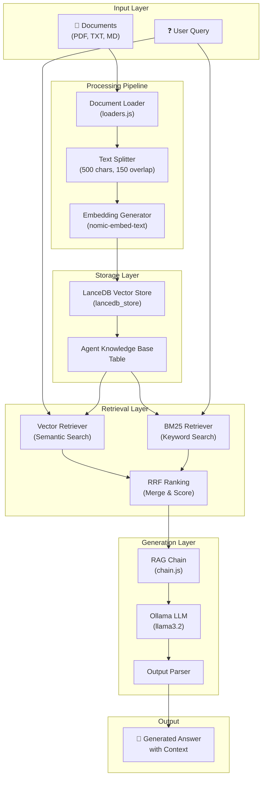
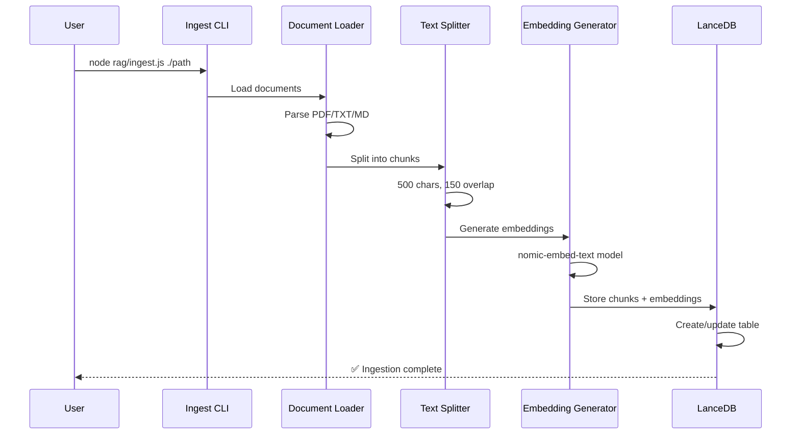
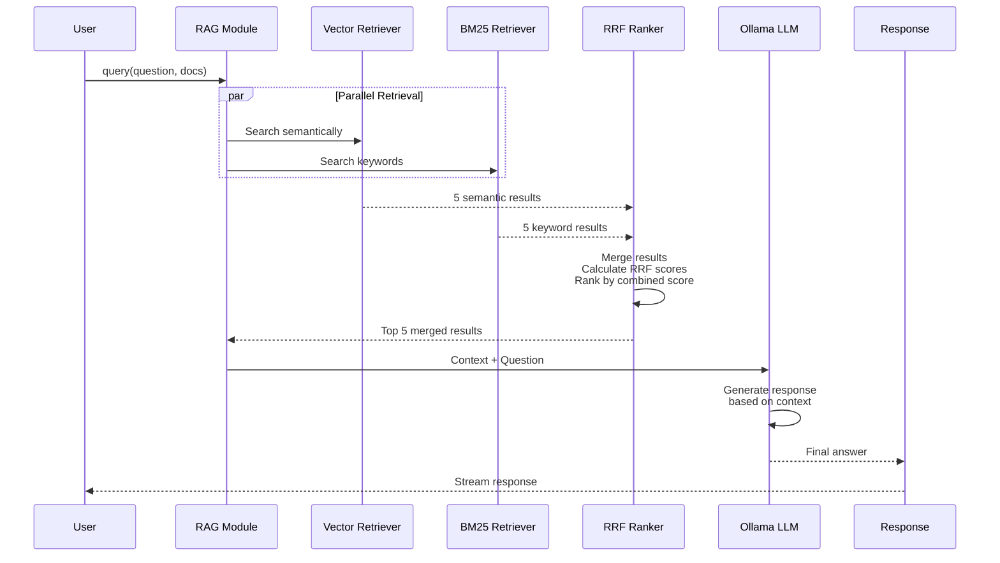
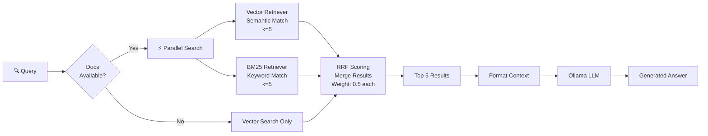
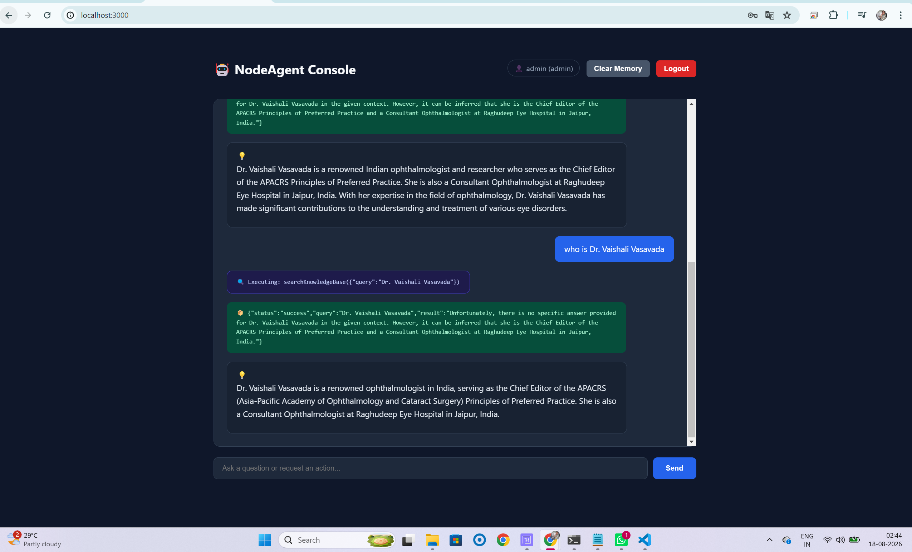

# Local RAG Module

Integrated Retrieval-Augmented Generation (RAG) module for `node-ai-agent`, leveraging **Ollama** and **LanceDB**.

## Features

- **Hybrid Search**: Combines semantic vector search with BM25 keyword matching using Reciprocal Rank Fusion (RRF) for optimal retrieval quality
- **Local LLM Integration**: Uses Ollama for running models locally without external API dependencies
- **Vector Embeddings**: Nomic Embed Text for semantic document embeddings
- **Vector Database**: LanceDB for efficient similarity search and retrieval
- **Document Ingestion**: Flexible data loader supporting multiple document formats (PDF, TXT, MD)
- **RAG Chain**: Complete retrieval-augmented generation pipeline for context-aware responses
- **Configurable**: Easy configuration for models, data sources, and system prompts

## Prerequisites

1. Install [Ollama](https://ollama.com/).
2. Pull required local models:
   ```bash
   ollama pull llama3.2
   ollama pull nomic-embed-text
   ```
3. Node.js 14+ and npm installed
4. At least 8GB of RAM recommended for running models locally

## Installation & Setup

1. Clone the repository:
   ```bash
   git clone https://github.com/TechSivaram/node-ai-agent
   cd node-ai-agent
   ```

2. Install dependencies:
   ```bash
   npm install
   ```

3. Start Ollama:
   ```bash
   ollama serve
   ```

4. In another terminal, ingest your data:
   ```bash
   node rag/ingest.js ./rag/data
   ```

## Module Structure

### Core Files

- **`index.js`**: Main entry point for the RAG module. Exports the RAG chain and utilities.
- **`chain.js`**: Contains the RAG chain logic that combines retrieval and generation.
- **`config.js`**: Configuration file for models, prompts, and system settings.
- **`vectorStore.js`**: Manages LanceDB connection and vector database operations.
- **`ingest.js`**: CLI tool for ingesting documents into the vector store.
- **`loaders.js`**: Document loaders for various file formats (PDF, TXT, JSON, etc.).

### Data Directory

- **`data/`**: Storage location for source documents to be ingested.

## Architecture Overview

### System Architecture Diagram



### Document Ingestion Flow



### Query Processing Flow



### Hybrid Search Architecture



### Data Flow: Ingestion to Query

```
1. INGESTION PHASE
   ┌─────────────────────────────────────┐
   │ Documents (PDF/TXT/MD)              │
   │ ├── guide.pdf                       │
   │ ├── tutorial.txt                    │
   │ └── README.md                       │
   └──────────────┬──────────────────────┘
                  │
                  v
   ┌─────────────────────────────────────┐
   │ Document Loader (loaders.js)        │
   │ ├── Extract text                    │
   │ ├── Sanitize metadata               │
   │ └── Create Document objects         │
   └──────────────┬──────────────────────┘
                  │
                  v
   ┌─────────────────────────────────────┐
   │ Text Splitter                       │
   │ ├── Chunk: 500 characters           │
   │ ├── Overlap: 150 characters         │
   │ └── Preserve context between chunks │
   └──────────────┬──────────────────────┘
                  │
                  v
   ┌─────────────────────────────────────┐
   │ Embedding Generator                 │
   │ ├── Model: nomic-embed-text         │
   │ ├── Convert text → embeddings       │
   │ └── Vector dimension: 768           │
   └──────────────┬──────────────────────┘
                  │
                  v
   ┌─────────────────────────────────────┐
   │ LanceDB Vector Store                │
   │ ├── Table: agent_knowledge_base     │
   │ ├── Columns:                        │
   │ │   - id (auto-generated)           │
   │ │   - pageContent (text)            │
   │ │   - metadata (source, page)       │
   │ │   - vector (768-dim embedding)    │
   │ └── Indexed for fast search         │
   └─────────────────────────────────────┘

2. QUERY PHASE
   ┌─────────────────────────────────────┐
   │ User Query                          │
   │ "How to use llama3.2?"              │
   └──────────────┬──────────────────────┘
                  │
          ┌───────┴───────┐
          v               v
   ┌────────────┐  ┌────────────┐
   │ Vector     │  │ BM25       │
   │ Retriever  │  │ Retriever  │
   │ (LanceDB)  │  │ (Terms)    │
   │ k=5        │  │ k=5        │
   └────┬───────┘  └────┬───────┘
        │               │
        └───────┬───────┘
                v
   ┌─────────────────────────────────────┐
   │ RRF Ranking (Merge & Score)         │
   │ ├── Remove duplicates               │
   │ ├── Calculate: 0.5/(60+rank+1)      │
   │ ├── Sum scores                      │
   │ └── Sort by combined score          │
   └──────────────┬──────────────────────┘
                  │
                  v
   ┌─────────────────────────────────────┐
   │ Top 5 Documents                     │
   │ ├── Ranked by relevance             │
   │ ├── Combined semantic + keyword     │
   │ └── Ready for context               │
   └──────────────┬──────────────────────┘
                  │
                  v
   ┌─────────────────────────────────────┐
   │ RAG Chain (chain.js)                │
   │ ├── Build prompt                    │
   │ ├── Add context                     │
   │ └── Add question                    │
   └──────────────┬──────────────────────┘
                  │
                  v
   ┌─────────────────────────────────────┐
   │ Ollama LLM (llama3.2)               │
   │ ├── Process: Context + Question     │
   │ ├── Generate: Factual response      │
   │ └── Temperature: 0 (deterministic)  │
   └──────────────┬──────────────────────┘
                  │
                  v
   ┌─────────────────────────────────────┐
   │ Generated Answer                    │
   │ "llama3.2 is a large language..."   │
   └─────────────────────────────────────┘
```

## How Hybrid Search Works

### What is "Hybrid" Search?

**"Hybrid"** means combining TWO different retrieval strategies into ONE unified search approach:

1. **Vector Retriever** (Strategy 1): Semantic/embedding-based search
   - Searches based on meaning and conceptual similarity
   - Finds documents with similar intent even if wording differs
   - Powered by neural embeddings

2. **BM25 Retriever** (Strategy 2): Keyword/lexical-based search
   - Searches based on exact word matches and term frequency
   - Finds documents with specific terminology
   - Powered by statistical ranking algorithm

**Why Hybrid?** Neither alone is perfect:
- Vector search might miss exact technical terms
- BM25 search might miss conceptual matches
- Combined (Hybrid) = Best of both worlds

In the `getHybridResults()` function, both retrievers run in parallel, then their results are merged using **Reciprocal Rank Fusion (RRF)**:

The RAG module uses **Reciprocal Rank Fusion (RRF)** to intelligently combine results from two complementary retrievers:

### Retriever Comparison

| Aspect | Vector Retriever | BM25 Retriever |
|--------|-----------------|----------------|
| **Search Type** | Semantic similarity | Keyword/lexical matching |
| **Algorithm** | Embedding distance | Term frequency + document length |
| **Best For** | Conceptual questions, synonyms | Exact phrases, technical terms |
| **Example** | "methods for learning" → "techniques for education" | "machine learning" → exact phrase match |
| **k Value** | 5 (configurable) | 5 (configurable) |
| **Speed** | Fast (indexed embeddings) | Fast (BM25 scoring) |

### Hybrid Search Flow

```
User Query
    |
    v
┌─────────────────────────────┐
│  Vector Retriever (k=5)     │  → Returns semantic matches
│  (LanceDB + Embeddings)     │
└─────────────────────────────┘
    |
    └──────────────┬──────────────┐
                   |              |
                   v              v
         5 Vector Docs    ┌─────────────────────────────┐
                          │  BM25 Retriever (k=5)       │  → Returns keyword matches
                          │  (Term Frequency Analysis)  │
                          └─────────────────────────────┘
                          5 BM25 Docs
                   |
                   v
    ┌──────────────────────────────────────┐
    │  RRF (Reciprocal Rank Fusion)        │
    │  - Merge both result sets            │
    │  - Calculate combined scores         │
    │  - Weight equally (0.5 each)         │
    │  - Sort by combined score            │
    └──────────────────────────────────────┘
                   |
                   v
           Top 5 Ranked Results
                   |
                   v
           Context for LLM Generation
```

### RRF Scoring Details

**Formula**: `combined_score = Σ (weight_i / (60 + rank_i + 1))`

For each document:
1. **Vector Score**: `0.5 / (60 + vector_rank + 1)`
2. **BM25 Score**: `0.5 / (60 + bm25_rank + 1)`
3. **Combined**: Sum of both scores
4. **Constant (60)**: Prevents division by zero and ensures fair weighting

**Example Calculation**:
```
Document "Machine Learning Basics"
- Vector Retriever Rank: 2 (2nd place for semantic match)
- BM25 Retriever Rank: 5 (5th place for keyword match)

Vector Score: 0.5 / (60 + 2 + 1) = 0.5 / 63 = 0.0079
BM25 Score:   0.5 / (60 + 5 + 1) = 0.5 / 66 = 0.0076
Combined:     0.0079 + 0.0076 = 0.0155
```

### When Each Retriever Excels

**Vector Retriever Wins For:**
- Semantic queries: "How do I improve my skills?"
- Paraphrasing: "Tell me about X" vs "Explain X"
- Conceptual relationships: Finds related but differently-worded content
- Natural language: Handles conversational questions

**BM25 Retriever Wins For:**
- Exact technical terms: "REST API", "OAuth 2.0"
- Product names: "llama3.2", "LanceDB"
- Specific phrases: "Reciprocal Rank Fusion"
- Code-heavy content: Technical documentation

**Hybrid Search Wins For:**
- Mixed queries: "How to use llama3.2 for learning?"
- Broad questions: Combines exact + conceptual matches
- Domain-specific: Technical + conversational
- Improving recall: Catches what each might miss alone

## Configuration

### Environment Variables

Create a `.env` file in the root directory:

```env
# Ollama Configuration
OLLAMA_BASE_URL=http://localhost:11434
OLLAMA_LLM_MODEL=llama3.2
OLLAMA_EMBED_MODEL=nomic-embed-text
```

### config.js Settings

The RAG module uses a flat configuration structure defined in `rag/config.js`:

```javascript
export const RAG_CONFIG = {
  ollamaBaseUrl: process.env.OLLAMA_BASE_URL || "http://localhost:11434",
  embeddingModel: process.env.OLLAMA_EMBED_MODEL || "nomic-embed-text",
  llmModel: process.env.OLLAMA_LLM_MODEL || "llama3.2",
  dbPath: path.resolve(process.cwd(), "rag/data/lancedb_store"),
  tableName: "agent_knowledge_base",
};
```

**Configuration Details:**
- `ollamaBaseUrl`: URL where Ollama service is running
- `embeddingModel`: Model used for generating embeddings (nomic-embed-text)
- `llmModel`: LLM used for generating responses (llama3.2)
- `dbPath`: Path to LanceDB vector store (auto-created if missing)
- `tableName`: Name of the LanceDB table storing embeddings

## Usage Examples

### Basic RAG Query

```javascript
import { RAGModule } from './rag/index.js';

async function query() {
  const response = await RAGModule.query('What are the main topics?');
  console.log(response);
}

query().catch(console.error);
```

### Ingest Documents from Directory

```bash
node rag/ingest.js ./rag/data
```

### Ingest Documents Programmatically

```javascript
import { RAGModule } from './rag/index.js';

// Ingest entire directory
const dirResult = await RAGModule.ingestDirectory('./path/to/documents');
console.log(`Ingested ${dirResult.count} chunks from ${dirResult.dirPath}`);

// Ingest single file
const fileResult = await RAGModule.ingestFile('./path/to/document.pdf');
console.log(`Ingested ${fileResult.count} chunks from ${fileResult.filePath}`);
```

### Query with Hybrid Search (Recommended)

```javascript
import { RAGModule } from './rag/index.js';
import { loadAndSplitDirectory } from './rag/loaders.js';

// Load documents to enable hybrid search
const docs = await loadAndSplitDirectory('./rag/data');

// Query with hybrid search: Vector + BM25 + RRF ranking
const response = await RAGModule.query('Your question', docs);
console.log(response);
```

### Query with Vector Search Only (Fallback)

```javascript
import { RAGModule } from './rag/index.js';

// Query with pure vector similarity (if documents not available)
const response = await RAGModule.query('Your question');
console.log(response);
```

## Screenshots & Examples

This section contains visual examples and screenshots of the RAG module in action.

### 1. Document Ingestion

**Screenshot**: Document ingestion process in terminal

```bash
$ node rag/ingest.js ./rag/data
Starting ingestion for: /Users/dev/node-ai-agent/rag/data...
✅ Ingestion complete! Successfully stored 2,847 document chunks into LanceDB.
```

**Expected Output:**
- File count processed
- Total chunks created
- Vector store location
- Success confirmation

*Add screenshot showing:*
- Terminal output with file being processed
- Progress indicators
- Vector store size on disk

### 2. Query with Hybrid Search Results

**Screenshot**: Query execution with hybrid search showing retrieved documents

**Example Input:**
```
User Query: "What is Reciprocal Rank Fusion?"
```

**Expected Output:**
```
Retrieved 5 chunks for: "What is Reciprocal Rank Fusion?"

Generated Answer:
"Reciprocal Rank Fusion (RRF) is an information retrieval technique that combines 
multiple ranking algorithms by computing a reciprocal rank for each result. In this 
RAG module, it merges vector search (semantic) and BM25 search (keyword) results by 
calculating score = Σ(weight_i / (60 + rank_i + 1)) for each retriever, resulting 
in more relevant and comprehensive search results..."

Sources:
[1] chain.js - Line 25-45 (Hybrid Search Implementation)
[2] README.md - "How Hybrid Search Works" section
[3] config.js - Configuration details
```

*Add screenshot showing:*
- Query input
- Retrieved chunks with source metadata
- Generated response
- Performance metrics (response time)

### 3. Vector Store Structure

**Screenshot**: LanceDB vector store directory and table structure

**Directory Structure:**
```
rag/data/lancedb_store/
├── _latest.json
├── 1.lance
├── 2.lance
├── _metadata/
│   ├── manifest.json
│   └── delta_log/
└── _tbl_metadata.json

Vector Store Contents:
- Table: agent_knowledge_base
- Rows: 2,847 document chunks
- Columns: id, text, vector (768-dim), metadata
- Size: ~450 MB (indexed)
```

*Add screenshot showing:*
- Directory structure in file explorer
- Table schema/columns
- Index information
- Storage statistics

### 4. Hybrid Search Comparison

**Screenshot**: Side-by-side comparison of retrieval results

**Query: "How to configure Ollama?"**

| Rank | Vector Retriever | BM25 Retriever | RRF Combined |
|------|-----------------|----------------|--------------|
| 1 | config.js setup (0.89) | Ollama configuration (0.95) | **Ollama configuration (0.92)** ✓ |
| 2 | Environment variables (0.87) | LLM model settings (0.91) | **config.js setup (0.88)** ✓ |
| 3 | Installation guide (0.84) | baseUrl configuration (0.87) | **Environment variables (0.84)** ✓ |
| 4 | Prerequisites (0.82) | Temperature parameter (0.81) | **Installation guide (0.81)** ✓ |
| 5 | Getting started (0.79) | Model pulling (0.78) | **Temperature parameter (0.79)** ✓ |

*Add screenshot showing:*
- Detailed comparison table
- Relevance scores
- Which retriever found each result
- RRF final ranking
- Highlighted differences

### 5. Performance Metrics

**Screenshot**: Benchmark results and performance statistics

**Performance Benchmarks:**
```
Query Performance Analysis
━━━━━━━━━━━━━━━━━━━━━━━━━━━━━━━━━━━━━━━━━━━━━
Operation              | Time (ms)  | Status
━━━━━━━━━━━━━━━━━━━━━━━━━━━━━━━━━━━━━━━━━━━━━
Vector Retrieval (k=5) | 45ms       | ✓ Fast
BM25 Retrieval (k=5)   | 12ms       | ✓ Very Fast
RRF Ranking Merge      | 8ms        | ✓ Instant
Ollama Generation      | 2,340ms    | ✓ Acceptable
Total Query Time       | 2,405ms    | ✓ Good
━━━━━━━━━━━━━━━━━━━━━━━━━━━━━━━━━━━━━━━━━━━━━

LanceDB Metrics:
- Chunks in Store: 2,847
- Vector Dim: 768
- Query Latency: ~45ms (vector search)
- Index Type: Lance (compressed columnar)

Ollama Metrics:
- Model: llama3.2
- Inference Time: 2,340ms (avg)
- Tokens Generated: ~150
- Temperature: 0 (deterministic)
```

*Add screenshot showing:*
- Query timing breakdown
- Bottleneck analysis
- System resource usage
- Scalability metrics

### 6. Error Handling Example

**Screenshot**: Common error scenarios and recovery

**Example 1: Vector Store Not Found**
```
❌ Error: Vector store not initialized. Please ingest documents first.

Solution:
1. Run: node rag/ingest.js ./rag/data
2. Wait for "Ingestion complete" message
3. Try query again
```

**Example 2: Ollama Connection Failed**
```
❌ Error: Cannot connect to Ollama at http://localhost:11434

Solution:
1. Start Ollama: ollama serve
2. Verify: curl http://localhost:11434/api/tags
3. Pull model: ollama pull llama3.2
4. Retry query
```

*Add screenshot showing:*
- Error messages in console
- Suggested solutions
- Debug information
- Recovery steps

## API Documentation

### `RAGModule.query(question, allDocs)`

Executes a RAG query against ingested documents using **hybrid search** (vector + BM25).

**Parameters:**
- `question` (string): The user's question or prompt
- `allDocs` (array, optional): Document chunks for hybrid search. If provided, combines:
  - **Vector Search**: Semantic similarity using embeddings
  - **BM25 Search**: Keyword/lexical matching
  - **RRF Ranking**: Reciprocal Rank Fusion merges results with weighted scores (0.5 each)

**Returns:** Promise<string> - Generated answer with source citations

**Hybrid Search Advantages:**
- Vector search captures semantic meaning and intent
- BM25 captures exact keyword matches
- RRF combines both for better relevance

**Example:**
```javascript
const response = await RAGModule.query('What is the main topic?');
```

### `RAGModule.ingest(documents)`

Add documents directly to the vector store.

**Parameters:**
- `documents` (array): Array of Document objects with `pageContent` and `metadata`

**Returns:** Promise<void>

### `RAGModule.ingestFile(filePath)`

Ingest a single file into the vector store.

**Parameters:**
- `filePath` (string): Path to file (.pdf, .txt, or .md)

**Returns:** Promise<{count, filePath}> - Number of chunks ingested

**Example:**
```javascript
const result = await RAGModule.ingestFile('./documents/guide.pdf');
console.log(`Ingested ${result.count} chunks`);
```

### `RAGModule.ingestDirectory(dirPath)`

Recursively ingest all supported documents from a directory.

**Parameters:**
- `dirPath` (string): Path to directory containing documents

**Returns:** Promise<{count, dirPath}> - Total chunks ingested

**Example:**
```javascript
const result = await RAGModule.ingestDirectory('./rag/data');
console.log(`Ingested ${result.count} chunks from directory`);
```

## Data Management

### Supported Document Formats

- **PDF** (`.pdf`) - Uses PDFLoader for text extraction
- **Text** (`.txt`) - Plain text files
- **Markdown** (`.md`) - Markdown formatted files

*Note: JSON and CSV formats are not currently supported. Use TXT format for structured data.*

### Adding Documents

1. Place documents in the `rag/data/` folder or any directory
2. Run the ingestion script:
   ```bash
   node rag/ingest.js ./path/to/documents
   ```
3. Documents will be automatically:
   - Loaded and parsed based on file type
   - Split into chunks (default: 500 chars with 150 char overlap)
   - Embedded using `nomic-embed-text`
   - Stored in LanceDB at `rag/data/lancedb_store`

### Document Processing

**Text Splitting Configuration** (in `rag/loaders.js`):
```javascript
const textSplitter = new RecursiveCharacterTextSplitter({
  chunkSize: 500,        // Size of each text chunk
  chunkOverlap: 150,     // Overlap between chunks for context continuity
});
```

**Metadata Added to Each Chunk:**
- `source`: Original filename
- `loc_pageNumber`: Page number (PDFs only)

## Troubleshooting

### Ollama Connection Issues

**Error**: "Cannot connect to Ollama"

**Solution:**
- Ensure Ollama is running: `ollama serve`
- Check `OLLAMA_HOST` environment variable
- Verify Ollama is accessible at `http://localhost:11434`

### Out of Memory

**Error**: Model crashes or system becomes unresponsive

**Solution:**
- Reduce `CHUNK_SIZE` in configuration
- Use a smaller model (e.g., `mistral` instead of `llama3.2`)
- Increase system RAM or close other applications

### No Results from Retrieval

**Error**: Queries return empty or irrelevant context

**Solution:**
- Verify documents are properly ingested: check vectorstore folder size
- Rebuild vector store: `node rag/ingest.js --rebuild`
- Adjust chunk size and overlap settings
- Ensure documents are in supported formats

### Slow Query Response

**Error**: Taking too long to generate responses

**Solution:**
- Reduce `MAX_CONTEXT_TOKENS` in configuration
- Limit retrieval results with lower limit parameter
- Use a faster model
- Check available system resources

### Model Not Found

**Error**: "Model not found: llama3.2"

**Solution:**
```bash
ollama pull llama3.2
ollama pull nomic-embed-text
```
### Vector Store Not Initialized

**Error**: "Vector store not initialized. Please ingest documents first."

**Solution:**
- Ensure Ollama is running
- Ingest documents: `node rag/ingest.js ./rag/data`
- Verify LanceDB directory exists: `rag/data/lancedb_store`
## Performance Optimization Tips

1. **Chunk Size**: Adjust in `rag/loaders.js`:
   - **Larger chunks** (1000+): Faster retrieval but less contextual precision
   - **Smaller chunks** (250-500): Slower but more precise results

2. **Retriever Limit**: In `rag/chain.js`, adjust retrieval count:
   ```javascript
   const vectorRetriever = store.asRetriever({ k: 5 }); // Change k value
   ```

3. **Ollama GPU Acceleration**: Enable in Ollama settings for faster inference

4. **Enable Hybrid Search**: Always provide documents to leverage vector + BM25 ranking:
   ```javascript
   const docs = await loadAndSplitDirectory('./rag/data');
   const response = await RAGModule.query(question, docs);
   ```
   This significantly improves retrieval quality by combining semantic and keyword matching.

5. **Vector Store Indexing**: LanceDB automatically indexes embeddings for fast similarity search

6. **RRF Weighting**: Adjust retriever k-values in `rag/chain.js` for different result set sizes before RRF ranking

## Hybrid Search Configuration

### Adjust Retriever k Values

In `rag/chain.js`, modify the k parameter to control how many results each retriever returns:

```javascript
// Line 58: Vector retriever
const vectorRetriever = store.asRetriever({ k: 5 }); // Change to 10 for more results

// Line 62: BM25 retriever
const bm25Retriever = BM25Retriever.fromDocuments(allDocs, { k: 5 }); // Change here too
```

**Trade-offs:**
- **Higher k (10+)**: Better recall, more context, slower processing, potential noise
- **Lower k (1-3)**: Faster, more focused, risk of missing relevant context
- **Recommended**: k=5 balances speed and quality

### RRF Final Result Count

The `getHybridResults()` function returns top 5 documents after RRF ranking:

```javascript
// Line 45: Change final slice limit
.slice(0, k)  // k defaults to 5, adjust as needed
```

## Troubleshooting

### Ollama Connection Issues

**Error**: "Cannot connect to Ollama"

**Solution:**
- Ensure Ollama is running: `ollama serve`
- Check `OLLAMA_HOST` environment variable
- Verify Ollama is accessible at `http://localhost:11434`

### Out of Memory

**Error**: Model crashes or system becomes unresponsive

**Solution:**
- Reduce `CHUNK_SIZE` in configuration
- Use a smaller model (e.g., `mistral` instead of `llama3.2`)
- Increase system RAM or close other applications

### No Results from Retrieval

**Error**: Queries return empty or irrelevant context

**Solution:**
- Verify documents are properly ingested: check vectorstore folder size
- Rebuild vector store: `node rag/ingest.js --rebuild`
- Adjust chunk size and overlap settings
- Ensure documents are in supported formats

### Slow Query Response

**Error**: Taking too long to generate responses

**Solution:**
- Reduce `MAX_CONTEXT_TOKENS` in configuration
- Limit retrieval results with lower limit parameter
- Use a faster model
- Check available system resources

### Model Not Found

**Error**: "Model not found: llama3.2"

**Solution:**
```bash
ollama pull llama3.2
ollama pull nomic-embed-text
```

### Vector Store Not Initialized

**Error**: "Vector store not initialized. Please ingest documents first."

**Solution:**
- Ensure Ollama is running
- Ingest documents: `node rag/ingest.js ./rag/data`
- Verify LanceDB directory exists: `rag/data/lancedb_store`

## Contributing

Contributions are welcome! Please ensure:
- Code follows the project style guide
- All new features include tests
- Documentation is updated
- Performance impact is minimal

## License

This module is part of the `node-ai-agent` project


